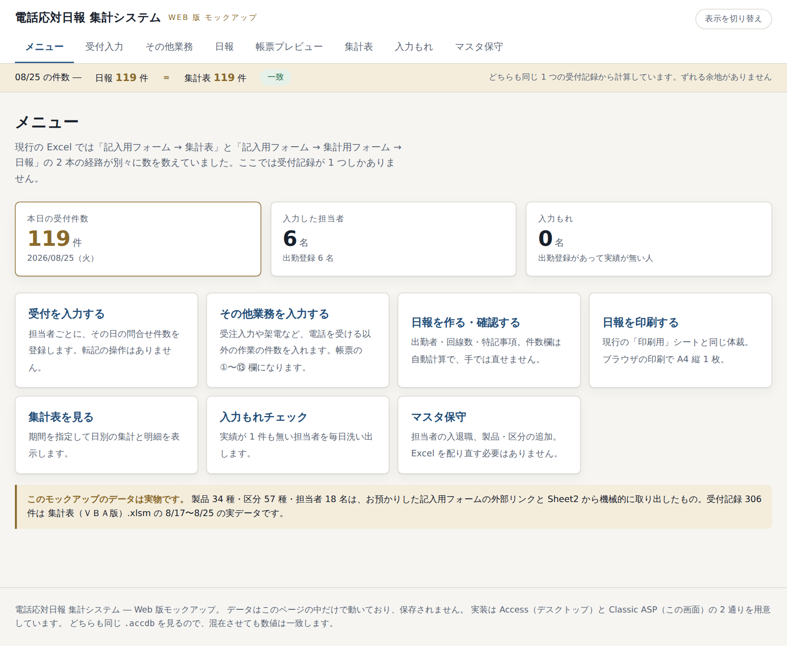

# はじめに ― このシステムでできること

電話でお受けした問合せの件数を記録し、**日報**と**集計表**を作るシステムです。
ブラウザ（Microsoft Edge など）だけで使えます。Excel は使いません。



---

## いままでと何が変わるか

| いままで（Excel） | これから |
|---|---|
| 自分の記入用フォームに入力 | ブラウザの**受付入力**に入力 |
| 日報の「更新」ボタンを押す | **不要**（入力した時点で反映されます） |
| 集計表の「転記」ボタンを押す | **不要** |
| 日報と集計表の数字が合っているか見比べる | **不要**（同じデータから作るのでずれません） |
| 印刷 | ブラウザの「印刷する」ボタン |

**「転記」という作業がなくなります。** 入力したその瞬間に、日報にも集計表にも反映されます。

---

## 1日の流れ

```
朝〜夕方   パート職員   受付入力       … 問合せを受けたら件数を足していく
夕方       パート職員   その他業務      … 受注入力や架電などの件数をまとめて入れる
夕方       職員         日報           … 出勤者・回線数・特記事項を入れて「確定する」
翌朝       職員         日報を印刷      … 前営業日の日報を印刷して回覧
週の終わり  職員         集計表         … 期間を指定して確認・印刷
```

---

## 開き方

1. デスクトップの「電話応対日報」のショートカットをダブルクリックします。
2. ブラウザが開いて、上の画面が出れば準備完了です。

> ショートカットが無いときは、担当者にご連絡ください。

画面の右上に**自分の名前**が出ます。ここが自分でない場合は担当者にご連絡ください。

---

## 画面の見方

いちばん上の青い帯に、画面を切り替えるボタンが並んでいます。

| ボタン | 何をする画面か |
|---|---|
| 受付入力 | 問合せの件数を入れる（毎日いちばん使います） |
| その他業務 | 受注入力・架電など、電話以外の作業の件数を入れる |
| 日報 | 出勤者・回線数・特記事項を入れて確定する |
| 集計表 | 期間を指定して数字を見る |
| 入力もれ | 入れ忘れている人がいないか確かめる |
| マスタ保守 | 担当者・製品・区分の追加や修正（担当者だけ） |

---

## 困ったら

- 操作が分からない → [困ったときは](04_困ったときは.md)
- 名前が一覧に無い → 担当者に「担当者マスタへの追加」を依頼してください
- 画面が真っ白・エラーが出た → 担当者にご連絡ください
