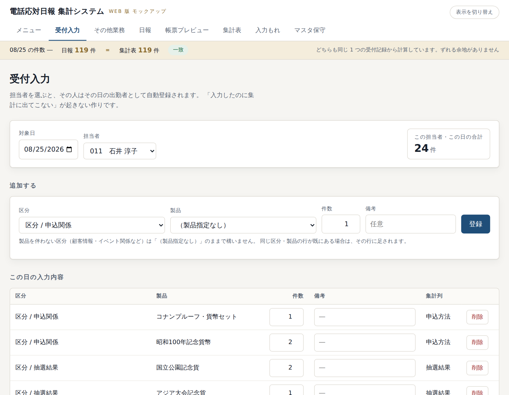
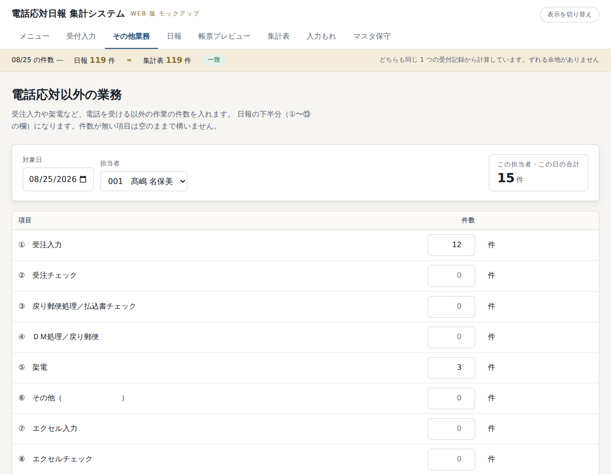

# 毎日の入力（パート職員のみなさま）

毎日使うのはこの 2 つの画面だけです。

1. **受付入力** … 電話でお受けした問合せの件数
2. **その他業務** … 受注入力・架電など、電話以外の作業の件数

---

## 1. 受付入力

上の帯の「**受付入力**」を押します。

### 手順

**① 対象日と自分の名前を選ぶ**

- **対象日** は今日の日付が最初から入っています。そのままで構いません。
- **担当者** の欄で自分の名前を選びます。

> 名前を選んだ時点で、その日の出勤者として自動的に登録されます。
> 別に出勤の登録をする必要はありません。

**② 区分・製品・件数を入れて「登録」を押す**

| 欄 | 入れかた |
|---|---|
| 区分 | 問合せの種類を選びます。「ブロック名 / 区分名」の形で並んでいます |
| 製品 | 製品についての問合せなら選びます。**製品と関係ない区分は「（製品指定なし）」のまま**で構いません |
| 件数 | 何件か。ふつうは 1 のままです |
| 備考 | 必要なときだけ。空でも構いません |

「**登録**」を押すと、下の一覧に追加されます。

**③ 同じ問合せがまた来たら**

下の一覧で、その行の**件数の数字を直して「更新」**を押します。
新しく「登録」してもかまいません（同じ区分・製品なら自動でまとめられます）。

**④ 間違えたら**

その行の「**削除**」を押します。確認が出るので「OK」を押してください。

---

## 2. その他業務

上の帯の「**その他業務**」を押します。

### 手順

1. **対象日**と**自分の名前**を選びます。
2. 項目ごとに件数を入れます。**0 件の項目は空のままで構いません。**
3. いちばん下の「**保存する**」を押します。

これが日報の下半分（①〜⑬ の欄）になります。

> 1 日の終わりにまとめて入れる想定です。
> 途中で入れて、あとから直しても構いません。

---

## よくある間違い

| こんなとき | どうなるか |
|---|---|
| 担当者を選ばずに登録しようとした | 「担当者と区分を選んでください」と出ます。名前を選んでからやり直してください |
| 件数に 0 を入れた | その行は削除されます（0 件の記録は残しません） |
| 昨日の分を入れ忘れた | 対象日を昨日の日付に変えれば、あとからでも入れられます |
| 自分の名前が一覧に無い | 担当者にご連絡ください（担当者マスタへの登録が必要です） |

---

## 覚えていただきたいこと

- **「転記」や「更新」のボタンを押す必要はありません。** 入れたらすぐ反映されます。
- **保存し忘れの心配はありません。** 受付入力は「登録」「更新」を押した時点で保存されています。
  （その他業務だけは最後に「保存する」が必要です）
- **数字が日報と合わないことはありません。** 同じデータから作っています。
