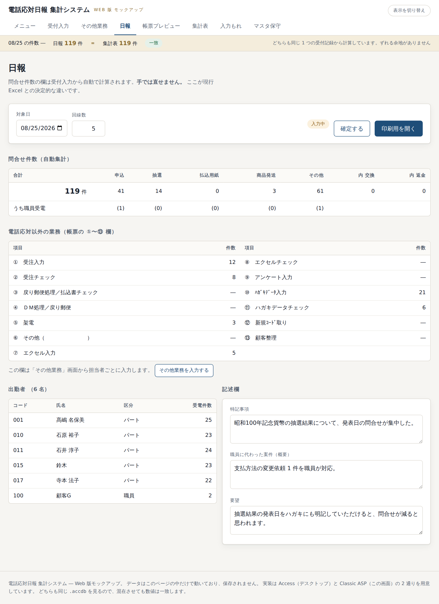
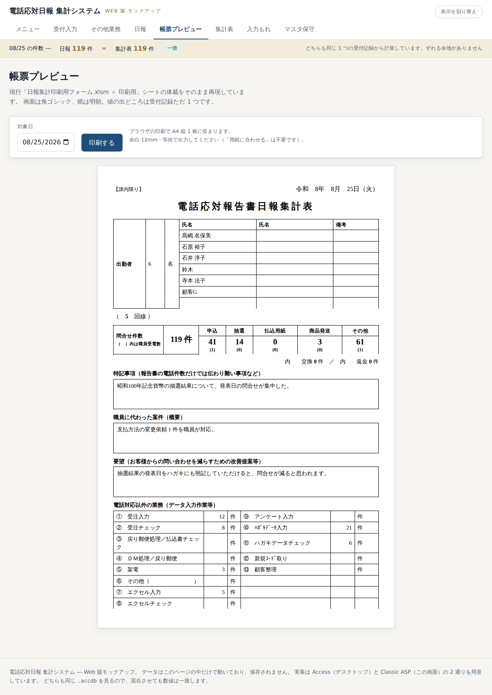
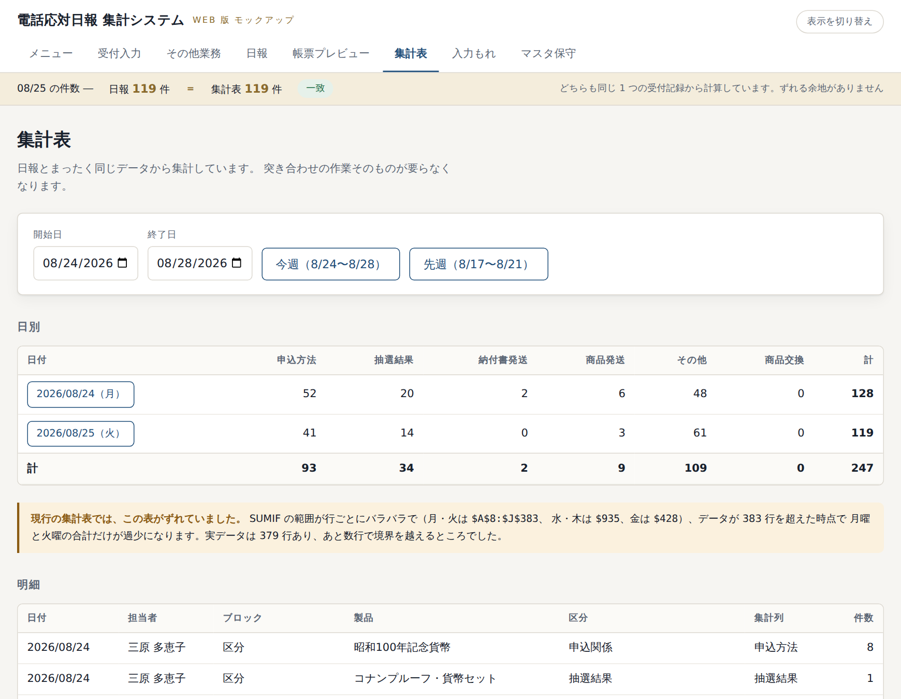
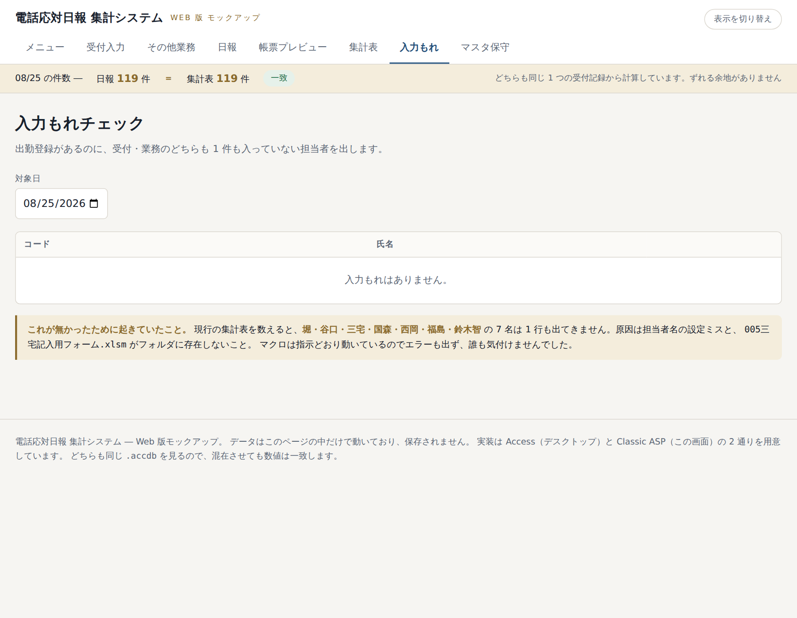

# 日報を作る（職員のみなさま）

夕方から翌朝にかけての作業です。

---

## 1. 日報画面を開く

上の帯の「**日報**」を押します。対象日は今日の日付が入っています。
前営業日の分を作るときは、日付を前日に変えるか「**« 前日**」を押します。

---

## 2. 問合せ件数を確認する

いちばん上の表が、その日の件数です。**この欄は自動で計算されるので、手で直すことはできません。**

| 欄 | 中身 |
|---|---|
| 合計 | その日の全件数 |
| 申込／抽選／払込用紙／商品発送／その他 | 種類ごとの件数 |
| （　）内 | そのうち職員が受けた件数 |
| 内 交換／内 返金 | その他の中の内訳 |

数字がおかしいと思ったら、それは**入力そのものが間違っている**ということです。
「受付入力」で該当する行を直してください。直せばこの欄もすぐ変わります。

---

## 3. 出勤者を確認する

「**在籍者を一括で追加**」を押すと、その日に在籍している人が全員入ります。
そのあと、**お休みの方の行の「外す」を押して**ください。

- 受付入力で名前を選んだ人は、自動的に出勤者として入っています。
- 「受電件数」が 0 の人がいたら、入力もれの可能性があります。

---

## 4. その他業務を確認する

出勤者の下に「電話応対以外の業務」の表があります。
空欄が多いときは、パート職員に入力を促してください。
「**その他業務を入力する**」から代わりに入れることもできます。

---

## 5. 記述欄を書く

| 欄 | 内容 |
|---|---|
| 回線数 | その日の回線数 |
| 特記事項 | 電話件数だけでは伝わらないこと |
| 職員に代わった案件 | 概要 |
| 要望 | 問合せを減らすための改善提案など |

書いたら「**保存する**」を押します。

---

## 6. 確定する

いちばん上の「**確定する**」を押します。

入力もれがある場合は、こんな警告が出ます。

> 実績が 1 件も無い担当者が 2 名います。確認してから、もう一度「確定する」を押してください。

心当たりがなければ「**入力もれ**」画面で確認してから、もう一度「確定する」を押してください。

確定すると状態が「**確定済み**」に変わります。あとから直したいときは「確定を解除」を押せば編集できます。

---

## 7. 印刷する

「**印刷用を開く**」を押すと、いまの Excel の「印刷用」シートと同じ体裁で表示されます。

「**印刷する**」を押すと、ブラウザの印刷画面が出ます。

| 設定 | 値 |
|---|---|
| 用紙 | A4 |
| 向き | 縦 |
| 余白 | 既定（12mm を指定済み） |
| 倍率 | 100%（「用紙に合わせる」は**不要**） |

**A4 縦 1 枚に収まります。** 画面の青い帯やボタンは印刷されません。

> 特記事項に長い文章を入れると、はみ出して 2 枚目に送られることがあります。

---

## 8. 集計表を見る

上の帯の「**集計表**」を押します。

- 「**今週**」を押すと月〜金が入ります。「先週」も同様です。
- 開始日・終了日を自分で入れることもできます。
- 「**印刷**」でそのまま印刷できます。

**日報と数字を見比べる必要はありません。** 同じデータから作っているので必ず一致します。

---

## 9. 入力もれチェック

上の帯の「**入力もれ**」を押します。

出勤登録があるのに、受付も業務も 1 件も入っていない人が出ます。
「入力画面を開く」を押すと、その人の受付入力画面にそのまま移れます。

> いまの Excel では、担当者名の設定ミスで 6 名分のデータが別人に合算されたり
> 消えたりしていましたが、誰も気付けませんでした。その再発を防ぐための画面です。
