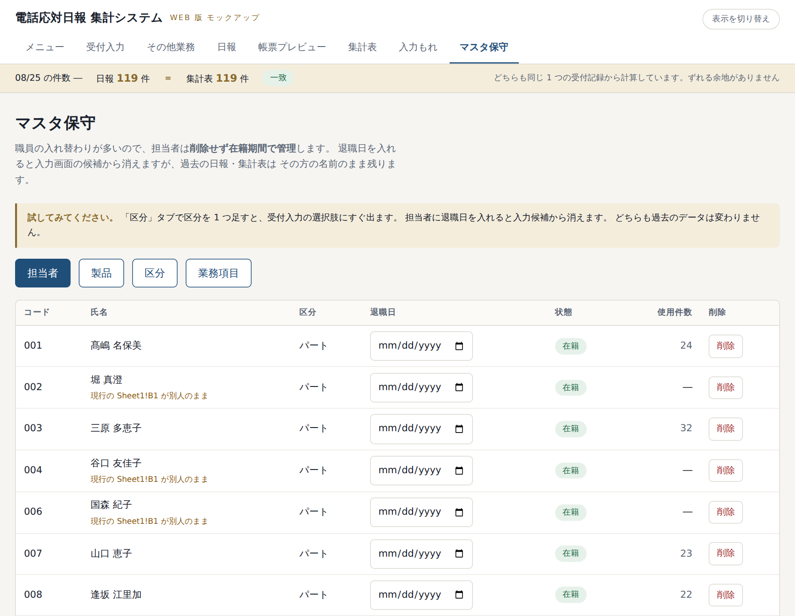
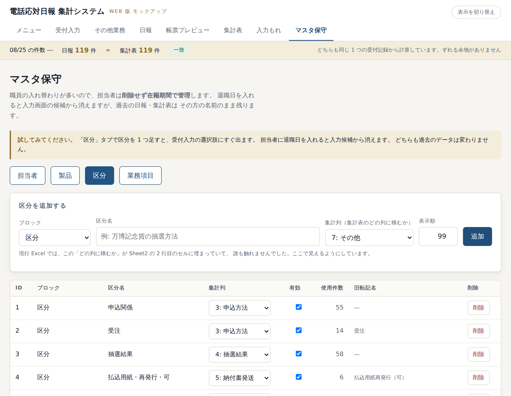

# マスタ保守（担当者のみなさま）

「マスタ」とは、入力画面の**選択肢**のことです。

| マスタ | 何の選択肢か |
|---|---|
| 担当者 | 受付入力の「担当者」欄 |
| 製品 | 受付入力の「製品」欄 |
| 区分 | 受付入力の「区分」欄 |
| 業務項目 | その他業務の項目（帳票の ①〜⑬） |

**変更はこの画面だけで完結します。** Excel を配り直したり、
ファイル名やセルを直したりする必要はありません。

上の帯の「**マスタ保守**」を押します。担当者として登録された方だけが開けます。

---

## いちばん大事な決まり

> ### 使われているものは削除できません。「有効」を外して無効にしてください。

一覧に「**使用件数**」という列があります。

| 使用件数 | できること |
|---|---|
| 「―」（0 件） | そのまま削除できます |
| 1 以上 | **削除は拒否されます。**「有効」のチェックを外してください |

無効にすると、入力画面の選択肢からは消えますが、**過去の日報・集計表はそのまま残ります**。
消してしまうと過去の帳票からその名前が失われるため、こうしています。

削除しようとすると、こんなメッセージが出ます。

> この区分は実績 55 件で使われているため削除できません。
> 代わりに「有効」のチェックを外してください。
> 入力候補から消えますが、過去の日報・集計表はそのまま残ります。

---

## 1. 担当者（入退職）

### 新しい方が入ったとき

上の「担当者を追加する」に入れて「**追加**」を押します。

| 欄 | 入れかた |
|---|---|
| コード | 席番号（`019` など）。**過去に使った番号を再利用してかまいません** |
| 姓・名 | 漢字。異体字（髙・﨑 など）もそのまま入れてください |
| カナ | 任意 |
| 区分 | **パート** または **職員**。帳票の「（　）内は職員受電数」がこれで決まります |
| 在籍開始日 | 初出勤日 |

### 退職されたとき

> ### 行は絶対に消さないでください。

一覧のその方の「**退職日**」に最終出勤日を入れて「保存」を押します。

- 翌日から入力画面の選択肢に出なくなります
- **過去の日報・集計表はその方の名前のまま残ります**

### 復帰されたとき

「退職日」を空にして「保存」を押します。

### 並び順を変えたいとき

「順」の数字を変えます。小さいほど上に出ます。

---

## 2. 製品

新しい製品が出たら「製品を追加する」に入れて「追加」を押します。

| 欄 | 入れかた |
|---|---|
| ブロック | 「区分」（上段の表）か「その他」（下段の表）か |
| 製品名 | そのまま入力画面に出ます |
| 販売開始日 | 任意 |
| 表示順 | 小さいほど上 |

追加した製品は**その場で受付入力の選択肢に出ます**。

販売が終わったら「**終了日**」を入れると選択肢から消えます。過去データは残ります。

---

## 3. 区分

区分を追加するときは「**集計列**」を必ず確認してください。
これがその区分を**集計表のどの列に積むか**を決めます。

| 集計列 | 帳票のどの欄になるか |
|---|---|
| 3 申込方法 | 申込 |
| 4 抽選結果 | 抽選 |
| 5 納付書発送 | 払込用紙 |
| 6 商品発送 | 商品発送 |
| 7 その他 | その他 |
| 8 商品交換 | その他（「内 交換」にも計上） |

「**内訳**」に `返金` と入れた区分は、帳票の「内 返金」に集計されます。

> いまの Excel では、この対応が `Sheet2` の 2 行目のセルに埋まっていて、
> 誰も触れませんでした。ここでは一覧の各行で選び直せます。

**旧転記名**の列は、いまの Excel が集計表に書いていた文言です。
過去データを取り込むときの照合に使うので、**書き換えないでください**。

---

## 4. 業務項目

帳票の ①〜⑬ の欄です。「**帳票表示名**」がそのまま印刷されます。

> ### 注意：帳票の枠は左 8 件・右 5 件の 13 個までです。
> 14 個目以降を追加しても、紙には載りません（画面には出ます）。
> 増やす必要があるときは、帳票の作り直しが必要なのでご相談ください。

---

## 変更したあとの確認

マスタを変えたら、**実際に受付入力の画面を開いて選択肢を確かめてください。**
1 分で終わりますし、これで「入れたはずなのに出てこない」を防げます。
